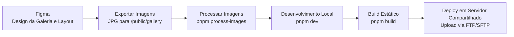

# 🏡 Casa Ella & Nina – Casa Boutique na Praia do Patacho

   


🚀 **Casa Ella & Nina** é um site de apresentação para uma casa boutique exclusiva localizada na **Praia do Patacho, Alagoas - Brasil**. Com um design moderno e minimalista, o site permite aos visitantes conhecerem o espaço, verem fotos, verificarem comodidades e realizarem reservas através do **Airbnb e Booking.com**.

---

## 🌟 Principais Características
- 🏝 **Casa Boutique na Praia do Patacho**
- 📸 **Galeria de Imagens Interativa**
- 🏠 **Detalhamento das Comodidades**
- 📅 **Reserva Fácil via Airbnb**
- 🎨 **Design Moderno e Responsivo**
- ⚡ **Performance Otimizada**
- 🌍 **SEO aprimorado para buscas no Google**

---

## 📷 Demonstração
🔗 [Acesse o site ao vivo](https://casasboutiquepatacho.com.br)


---

## 🚀 Como Rodar o Projeto Localmente
Siga os passos abaixo para rodar o projeto no seu ambiente local:

### 🔹 1. Clone o repositório
```sh
git clone https://github.com/seu-usuario/casa-ella-e-nina.git
cd casa-ella-e-nina
```

### 🔹 2. Instale as dependências
```sh
pnpm install
```

### 🔹 3. Rode o ambiente de desenvolvimento
```sh
pnpm dev
```

Acesse **[http://localhost:3000](http://localhost:3000)** no seu navegador.

---

## 🛠 Tecnologias Utilizadas
O projeto foi desenvolvido com as seguintes tecnologias:

- **Next.js 14.2.15**
- **React 18.3.1**
- **TailwindCSS 3.4**
- **Swiper.js 11**
- **Lucide-react & Heroicons**
- **Motion (Framer Motion)**
- **Sharp** para otimização de imagens
- **PNPM** como gerenciador de pacotes

---

## ⚙️ Stack Técnica Atualizada
**Frontend**
- Next.js 14.2.15  
- React 18.3.1  
- TailwindCSS 3.4.18  
- Swiper 11.2  
- Motion 11.18  
- Lucide-react / Heroicons  
- clsx, tailwind-merge, class-variance-authority  

**Ferramentas de Build**
- Sharp  
- PostCSS  
- cssnano  
- PNPM  

**Dev Experience**
- ESLint 8.57  
- eslint-config-next 14.2  
- TypeScript (tipos para React)

---

## 📂 Estrutura do Projeto
```
casa-ella-e-nina/
├── public/            # Arquivos estáticos (favicon, imagens, etc)
├── out/               # Arquivos exportados para servidor compartilhado
├── src/
│   ├── app/           # Páginas e componentes do Next.js
│   ├── components/    # Componentes reutilizáveis
│   ├── styles/        # Arquivos de estilo
│   └── utils/         # Funções auxiliares
├── .next/             # Build gerado pelo Next.js
├── package.json       # Dependências do projeto
├── README.md          # Documentação do projeto
└── screenshot.jpg     # Captura de tela do site
```

---

## 🌐 Como Fazer o Deploy em Servidor Compartilhado
Se seu servidor compartilhado **não suporta Node.js**, você pode exportar o Next.js como um site estático e copiá-lo para o servidor.

### 🔹 1. Gerar os arquivos estáticos
```sh
pnpm build
```
Isso criará uma pasta `/out` com os arquivos estáticos prontos para deploy.

### 🔹 2. Comprimir e copiar para o servidor
```sh
tar -czvf deploy.tar.gz out/
```
Em seguida, faça upload do `deploy.tar.gz` para o servidor via **FTP, SFTP ou gerenciador de arquivos do cPanel**.

### 🔹 3. Descomprimir no servidor
Conecte-se ao servidor e extraia os arquivos na pasta pública:
```sh
tar -xzvf deploy.tar.gz -C /caminho/para/public_html/casasboutiquepatacho.com.br
```
Se o servidor exigir, renomeie a pasta `out/` para `public_html` ou o diretório correto do seu host.

Agora seu site estará acessível pelo domínio configurado no servidor compartilhado!

---


## 🧩 Fluxo Visual do Projeto

Para entender rapidamente como o site é mantido e atualizado, o fluxo geral é:



## 🖼 Atualizar Galeria

### 🔹 4. Para atualizar a galeria

[Design da Galeria no Figma](https://www.figma.com/design/45ghSD3NruldDrhfiSROyV/Casa-boutique?node-id=653-114&t=LPHLKt17ge9k99rk-1)

1. Abra o **Figma** e vá até a página **Galerias**.
2. Crie uma nova galeria baseada no modelo existente.
3. Renomeie e **exporte no formato JPG** para a pasta:
   ```sh
   public/gallery/gallerie-00
   ```
   (Incremente o número da galeria conforme necessário.)
4. Rode o comando para processar as imagens:
   ```sh
   pnpm process-images
   ```

---

## 🚀 SEO e Boas Práticas
- Títulos e descrições configurados para compartilhamento (Open Graph + Twitter Cards)
- Sitemap e robots.txt configurados
- Imagens otimizadas automaticamente via Sharp
- Lighthouse ≥ 95 em Performance / Acessibilidade / SEO

---

## 🔥 Melhorias Futuras
- Integração com **Google Analytics** para métricas de acessos
- Implementação de um **CMS** para edição dinâmica de conteúdo
- SEO contínuo para melhorar ranqueamento

---

## 🔄 CI/CD (Opcional)
Caso queira automatizar deploys estáticos, você pode usar:

- **GitHub Actions**  
- **Vercel (somente para preview)**  
- **Scripts automáticos de build e upload via SFTP**

Exemplo simples de workflow:
```yaml
name: Build Static Export

on:
  push:
    branches: [ main ]

jobs:
  build:
    runs-on: ubuntu-latest
    steps:
      - uses: actions/checkout@v3
      - uses: pnpm/action-setup@v2
        with:
          version: 10
      - run: pnpm install
      - run: pnpm build
```

---

## 📌 Licença
Este projeto é **privado**, todos os direitos reservados.

📩 **Dúvidas ou sugestões?** Entre em contato! 😃
